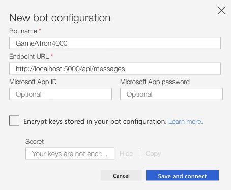

# Trial 1: Test the Game-A-Tron 4000™ bot locally

In this lab you'll learn how to use the emulator to test a bot. You will also learn how you can connect the Azure Bot Service to a bot running on your local machine to allow for debugging.

## 1. Test locally using the Emulator

1. Open the project folder in Visual Studio Code.

2. In Visual Studio Code, select **Debug | Start Debugging**.

3. In the web browser that opens, make a note of the URL (nevermind the 405 HTTP error, the bot doesn't accept GET requests).

4. Start the Bot Framework Emulator.

5. Select **File | New Bot Configuration...**.

6. On the **New bot configuration** dialog, enter *GameATron4000* as the bot name and the endpoint you saved from the browser when you started debugging. Leave the MSA app ID and MSA app password blank for now.



7. Click **Save and connect**, name your bot file *GameATron4000.bot*, and save the file in the Game-A-Tron 4000™ project folder.

8. The emulator will connect to the bot. Choose *ReturnOfTheBodySnatchers* as the game you want to play. You can now enter messages like *look at newspaper* to play the game.


9. In Visual Studio, select **Debug | Stop Debugging**.

## 2. Test locally using the Point & Click client

The Game-A-Tron 4000™ graphical user interface uses a Direct Line channel to connect to the bot. To get a Direct Line channel the bot needs to be registered with the Azure Bot Service. This is just a registration to make use of the provided channels, the bot code itself can run anywhere you want.

### Install and run ngrok

For now, we'll just keep it running on your local machine. You'll use **ngrok** to expose your local machine (which may be behind NATs and firewalls) to the public internet over a secure tunnel. This enables the Azure Bot Service on the web to forward messages directly to your local machine to allow for debugging.

1. Download ngrok from https://ngrok.com/download.

2. From the command line, run the following command:

```
ngrok http -host-header=rewrite 5000
```

3. When ngrok starts, it will display the public forwarding HTTPS URL you’ll need to copy and save for later, as highlighted below:


### Register an Azure AD application

To secure the connection between the Azure Bot Service and the bot, register an application with Azure AD to get a Microsoft app ID and password.

1. To register an application with Azure AD execute the following command from the command line (or Cloud Shell in Azure Portal). Replace *\<Tenant>* with the Azure tenant name (name of the AD) and *\<MSA password>* with the password you want to use for the application registration.  

```
az ad app create --display-name GameATron4000 --identifier-uris http://<Tenant>.onmicrosoft.com/gameatron4000 --password <MSA password> --available-to-other-tenants true
```

After the command has completed, the output JSON will contain an ```appId``` element with the MSA app ID. Make a note of it as you'll need it shortly.

### Add the credentials to the .bot file

A .bot file acts as the place to bring all service references together to enable tooling. Game-A-Tron 4000™ uses the .bot file to load service configuration information such as the Azure Bot Service registration,  MSA app ID and password, and the Direct Line secret.

You previously created a .bot file using the Bot Framework Emulator. Now you will update the .bot file with the MSA app id and password.

1. Switch back to the emulator, right-click on the endpoint, and select **Edit settings**.

2. Fill in the MSA app ID and password and click **Submit**.

At this point, you can start the debugger again to test the bot in the emulator (select **Restart conversation** in the emulator). Both the Game-A-Tron 4000™ bot and the emulator now use the MSA app id and password from the .bot file for authorization.

### Create the Azure Bot Service registration

We'll use the Azure CLI tool to register the Game-A-Tron 4000™ bot with the Azure Bot Service. Alternatively, you can use the Cloud Shell in the Azure Portal, or the Portal UI.

1. Start by creating a resource group:

```
az group create --name GameATron4000RG --location westus
```

2. Use this newly created Resource Group as the default group in any subsequent
commands so we don't have to type it in each time. Tell the CLI that we want
everything stored in the West US data center too.

```
az configure --defaults group=GameATron4000RG location=westus
```

3. Create the registration using the ngrok public forwarding HTTPS URL. Note that ```/api/messages``` must be appended to get the full endpoint URL. **Make sure you use a unique name for the registration (in stead of 'GameATron4000Reg') and use this name throughout the rest of the trial.**

```
az bot create --kind registration --name GameATron4000Reg --appid <MSA app ID> --password <MSA password> --endpoint <ngrok HTTPS URL>/api/messages --sku F0
```

4. Next, create a Direct Line channel for the bot registration:

```
az bot directline create --name GameATron4000Reg
```

After the command has completed, the output JSON will contain a ```key``` element with the Direct Line secret.

### Add service connections to the .bot file

Now you will add additional configuration information for the Azure Bot Service registration and the Direct Line channel to the .bot file.

This time, we'll use the [MSBot](https://github.com/Microsoft/botbuilder-tools/blob/master/packages/MSBot/README.md) tool to add the information to the file. Run the tool from the Game-A-Tron 4000™ project folder. It will automatically find and update your .bot file:

1. Add the service configuration to connect to the Azure Bot Service (you can get the subscription id by running `az account show`):

```
msbot connect bot --serviceName GameATron4000Reg --tenantId <Tenant>.onmicrosoft.com --subscriptionId <Azure Subscription ID> --resourceGroup GameATron4000RG --appId <MSA app ID> --appPassword <MSA password> --endpoint <ngrok HTTPS URL>/api/messages
```

2. Add the service configuration to connect to the Direct Line channel. Direct Line channels are not natively supported as a connected resource, so you'll use the `connect generic` command to connect a generic service configuration which contains the Direct Line secret. Use the Direct Line secret that was returned in the output JSON when you created the channel in Azure.

```
msbot connect generic --name DirectLine --url "no-url" --keys "{\"secret\":\"<Direct Line secret>\"}"
```

### Run the game in the browser

1. Return to Visual Studio Code and select **Debug | Start Debugging**.

3. In the web browser that opens, remove `/api/messages/` from the URL.

4. Select *Return of the Body Snatchers*.

The game GUI will now load. If you open your browser's developer tools you can view the interaction between the bot and the browser in the console log.