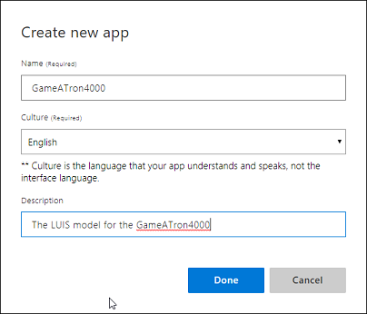
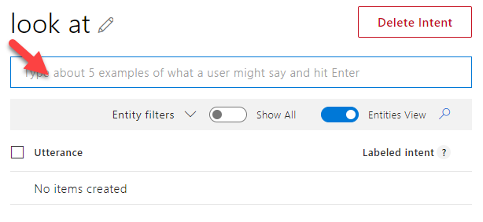
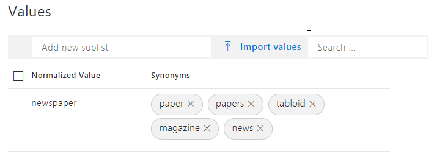
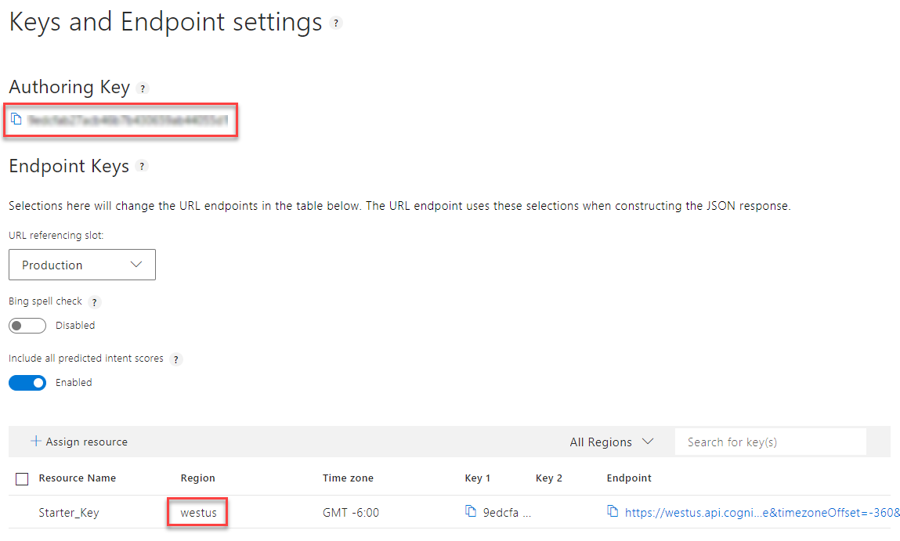
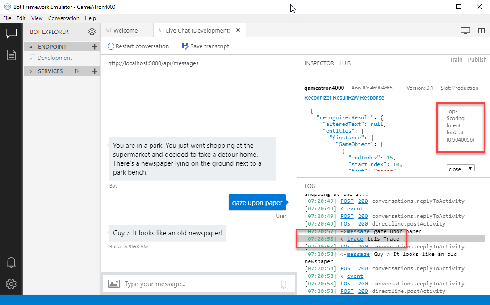

# Trial 3: Add natural language support

In this module, you're going to integrate the Game-a-Tron 4000™ bot with LUIS - the Language Understanding Intelligent Service. This is an Azure Cognitive Service that can interpret natural language. 

The current state of the bot requires a player to enter the commands exactly as they are defined in the gameplay scripts. Typing `lookat newspaper` for instance, would not work and should be `look at newspaper`. In this case you only missed a white-space in the command. But imagine a player typing a command like `inspect newspaper`. This perfectly describes what the intent of the player is, but would also not work because the game-engine expects exactly a command in the form: `look at <object name | actor name>`.

By adding LUIS to the bot, your players will be able to issue commands like `inspect newspaper`. LUIS can then detect the actual command that the player wanted to issue. In LUIS terminology this is called the *intent*. You can also use LUIS to identify what the object is that you want to execute the command on. In LUIS terminology this is called the *entity*. 

In the schematic overview below you can see how this will technically work:


In this module you will add LUIS to the solution by executing the steps described below.

## Create a LUIS account

In this step you will create a LUIS account. If you already have a LUIS account, you can skip this step obviously.

1. Go to [https://www.luis.ai](https://www.luis.ai).

2. Click on the **Sign up / Login** button.

3. Sign in with a Microsoft account. A LUIS account will be created and you will be redirected to the registration page. 

4. Answer the registration questions and make sure you agree with the Cognitive Services terms.

## Create a LUIS application

Within a LUIS account you can create multiple LUIS applications. In this step you will create an application for the Game-a-Tron 4000™ bot. 

1. Click the **+ Create new app** button.

2. Enter `GameATron4000` as name, `English` as culture and a description:
  
   

3. Click the **Done** button to create the app.

## Add intents

In order to train your model, you have to add *intents*. An intent is something the user wants to achieve. For the game-engine, every possible command that can be issued by the player needs to be added as an intent. The available commands that are supported by the game are: *look at*, *talk to*, *pick up*, *open*, *close*, *use*, and *give*. 

You will start by adding support for the *look at* command by executing the following steps:

1. Make sure you're logged into the LUIS portal and have selected the LUIS application that you've created.

2. Select the **Intents** option under the **App Assets** section in the menu on the left.

3. Click the **+ Add intent** button to add a new intent.

4. Enter `look at` as name for the new intent and click the **Done** button to create it. 

## Add utterances

The newly created intent will automatically be selected. Now it is time to add *utterances* to the intent. An utterance is a sentence that LUIS will use to recognize the *look at* intent. The more utterances you add, the better LUIS will be able to determine the intent. Now add a couple of utterances for the *look at* intent:

1. Click the text-box just below the name of the intent to give it focus:

   

2. Type the following utterances, each followed by *enter*:
	- look at newspaper
	- watch newspaper
	- inspect newspaper
	- gaze upon newspaper
	- examine newspaper

Now you have provided LUIS with several utterances that all express the intent to look at something. But LUIS cannot yet determine what it is that you want to look at. To enable LUIS to determine that, you need to provide LUIS with *entities*.  

## Add entities

All the utterances that you've added so far contained the object *newspaper*. This is one of the objects that are supported in the game-engine. The complete list of supported entities is: *newspaper*, *todolist*, *grocery list*, *bags of groceries* and *fridge*. 

You will add these entities to the model by executing the following steps:

1. Make sure you're logged into the LUIS portal and have selected the LUIS application that you've created.

2. Select the **Entities** option under the **App Assets** section in the menu on the left.

3. Click the **+ Create new entity** button.

4. Name the new entity *GameObject*, select *List* as entity type and click the **Done** button to create the new Entity.

The newly created entity will automatically be selected. Now you will add values to this entity by executing the following steps:

5. Click the **Add new sublist** text-box.

6. Enter the word `newspaper` followed by *enter*.  

3. Click the **Synonyms** column of the new *newspaper* row to add synonyms and add the following synonyms (each one followed by *enter*:
	- paper
	- papers
	- tabloid
	- news
	- magazine  

    Your screen should look  something like this:

    

If you now go back and look at the *look at* intent, you will see that LUIS already recognized that the *newspaper* term in the utterances you specified corresponds to the *GameObject* entity:


Now it's time to train and publish the model so you can use it in the game-engine.

## Train and publish the model

Train and publish the model by executing the following steps:

1. Make sure you're logged into the LUIS portal and have selected the LUIS application that you've created.

2. Click the **Train** button in the top-right of the portal and wait for the notification to appear that training has been finished successfully. 

3. Click the **Publish** button in the top-right of the portal.

4. Select *Production* as environment and click the **Publish** button to publish the model.

In order to use the model from the game-engine, you need to collect a couple of properties of the published application:  

5. Click the **Manage** option in the top-right of the portal.

6. Copy the *Application Id* of the application on the **Application Information** tab and store it somewhere.

7. Go to the **Keys and Endpoints** tab.

8. Copy the *Authoring Key* and store it somewhere.

9. Copy the *Region* from the **Starter_Key** row in the resources table and store it somewhere. 

    

## Add LUIS to the game-engine

Now that you have a trained and published the model, it's time to integrate it with the bot. 

### Generate the LUIS model

LUIS offers a .NET Core CLI tool for generating a helper class for interpreting the result of a call to your LUIS model. The input for this tool is an export of your trained LUIS model. Such an export can be made from the LUIS portal, but I have already added the exported model to the project. It is in the `luismodel-0.1.json` file in the `/src/LUIS` folder of the project.   

Execute the following steps to generate the LUISModel class:

1. Install luisgen on your machine by opening a command-prompt and issuing the following command:

    ```
    dotnet tool install -g LUISGen
    ```

2. Change the current working-folder to the `/src/LUIS` folder of the GameATron4000 repository.

3. Issue the following command:

    ```
    luisgen luismodel-0.1.json -cs LUISModel
    ```
    
    A file called `LUISModel.cs` will be created. 

4. Open the generated code file in Visual Studio Code and change the namespace to `GameATron4000.LUIS`.

### *ToCommand* extension method

In order to make using the generated LUISModel class as easy as possible, you will add a `ToCommand` extension method to the generated LUISModel class. 

1. Add a new file called `LUISModel.Extensions.cs` to the `/src/LUIS` folder.

2. Paste the following code-snippet into the file:
	```csharp
	using System.Collections.Generic;
	using System.Linq;
	using System.Threading.Tasks;
	
	namespace GameATron4000.LUIS
	{
	    public static class LUISModelExtensions
	    {
	        public static string ToCommand(this LUISModel recognizerResult)
	        {
	            // parse LUIS results to get intent and entity
	            string intent = GetLUISIntent(recognizerResult);
	            if (intent != null)
	            {
	                IEnumerable<string> entities = GetLUISEntities(recognizerResult);
	                if (entities.Count() > 0)
	                {
	                    switch(intent)
	                    {
	                        case "use":
	                            return $"use {entities.First()} with {entities.Last()}";
	
	                        case "give":
	                            return $"give {entities.First()} to {entities.Last()}";
	                        
	                        default:
	                            return $"{intent} {entities.First()}";        
	                    }
	                }
	            }
	
	            return null;
	        }
	
	        #region LUIS result parsing
	
	        private static string GetLUISIntent(LUISModel luisResult)
	        {
	            string intent = null;
	            var topIntent = luisResult.TopIntent();
	            if (topIntent.intent  != LUISModel.Intent.None)
	            {
	                intent = topIntent.intent.ToString().Replace("_", " ");
	            }
	            return intent;
	        }
	
	        private static IEnumerable<string> GetLUISEntities(LUISModel luisResult)
	        {
	            List<string> entities = new List<string>();
	
	            if (luisResult.Entities.GameObject?.Count() > 0)
	            {
	                entities.AddRange(luisResult.Entities.GameObject.Select(o => o[0]).ToList());
	            }
	            if (luisResult.Entities.GameActor?.Count() > 0)
	            {
	                entities.AddRange(luisResult.Entities.GameActor.Select(o => o[0]).ToList());
	            }
	
	            return entities;
	        }
	
	        #endregion
	    }
	}
	```  

3. Examine the code. This method will take the result of a call to your LUIS model, interpret it and turn into a bot command. This is a fairly specific implementation that assumes you're using 2 entities of type list named *GameObject* and *GameActor*.

### Add the LUIS service to the bot

Now you will add the LUIS Service to the bot. Execute the following steps:

1. Open the `BotServices.cs` file in the `/src/Core` folder.

2. Replace the line `// TODO Trial 3: Add LUIS service` with the following code-snippet:

	```csharp
	case ServiceTypes.Luis:
	{
	    var luis = (LuisService)service;
	    var app = new LuisApplication(luis.AppId, luis.SubscriptionKey, luis.GetEndpoint());
	    var recognizer = new LuisRecognizer(app);
	    LuisServices.Add(luis.Name, recognizer);
	    break;
	}
	```

### Call LUIS from the bot

Now you will add a call to LUIS from the bot code. This will make sure that all input from the user is sent through LUIS. Execute the following steps:

1. Open the `GameBot.cs` file in the `/src/Core` folder.

2. Import the `GameATron4000.LUIS` namespace by adding a using statement: 
	```csharp
	using GameATron4000.LUIS;
	```

2. Find the `OnTurnAsync` method. 

3. Replace the line `// TODO Trial 3: Add call to LUIS service` with the following code-snippet:
	```csharp
	// get command from LUIS (if enabled)
	if (_luisOptions.Enabled)
	{
		var recognizerResult = await _services.LuisServices["gameatron4000"]
			.RecognizeAsync<LUISModel>(context, cancellationToken);
		string command  = recognizerResult.ToCommand();
		if (!string.IsNullOrEmpty(command))
		{
			context.Activity.Text = command;
		}
	}
	```

4. Examine the code. You see the check to see whether or not LUIS integration is enabled. After that you see the call to LUIS and the interpretation of the result by calling the `ToCommand` extension method you created earlier. If this yields a command, we replace the input of the user (*Text*) on the incoming activity. 

### Configure the LUIS connection

Now that all the code to integrate LUIS with your bot is in place, you will configure the bot to use LUIS by executing the following steps: 

1. Open the `appSettings.Development.json` file in the root of the project.

2. Enable LUIS by setting the setting `LUIS.Enabled` element to `true`:
	```json
	"LUIS": {
 		"Enabled": true
	}
	```

Now add the LUIS service configuration to the `GameATron4000.Development.bot` file using the **msbot** command line utility: 

3. Open a command-prompt and change the current working-folder to the `/src/` folder.

4. Issue the following command. Use the app id and keys from the previous steps in this module.

    ```
    msbot connect luis --name gameatron4000 --appId <appid> --version 0.1 --authoringKey <authoringkey> --subscriptionKey <authoringkey> --region westus --bot GameATron4000.Development.bot
    ```

### Test the bot

Now you will test the bot using the Bot Framework Emulator by executing the following steps:

1. Run the bot by pressing `F5` in VS Code.

2. Start the Bot Framework Emulator.

3. Open a new bot configuration by clicking the `Open bot` button.

4. Select the `GameATron4000.Development.bot` file.

5. You will start in the initial Park room. There's a newspaper on the ground. Try different commands for looking at the newspaper that you used when training the LUIS model. You will see that the bot will call LUIS and interpret the intent and entities correctly:

    
 
6. As you can see in the screenshot, you're able to see the LUIS call and results in the inspector window in the emulator.

That's it! I hope you enjoyed enriching your Game-a-Tron 4000™ bot with natural language capabilities by integrating LUIS into it. Obviously this exercise barely scratches the surface of what's possible with LUIS. If you want to know more, check out the Microsoft documentation and video's on this subject available on the Internet.